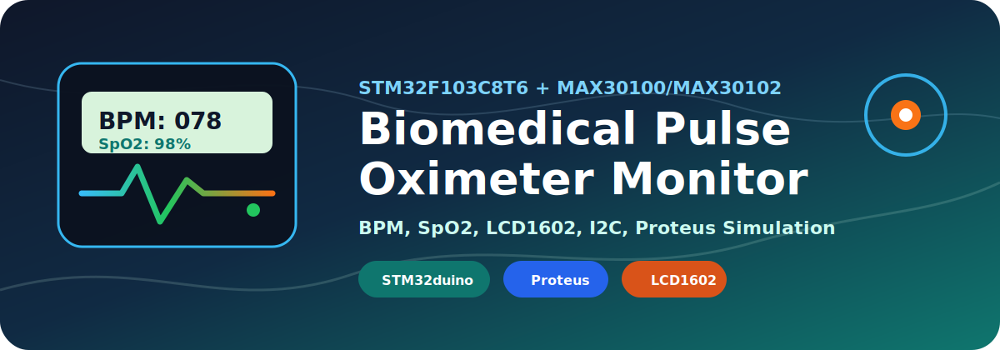
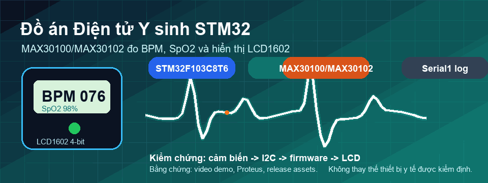

<p align="center">
  
</p>

<h1 align="center">🫀 Đồ án Điện tử Y sinh: STM32 + MAX30100/MAX30102 + LCD1602</h1>

<p align="center">
  <a href="https://github.com/lhlizdabezt/DoAnDienTuYSinh_STM32_MAX30100_LCD/releases/latest"></a>
  
  
  
  
</p>

<p align="center">
  <a href="./22207056_DoAnDienTuYSinh_22DTV_CLC1.pptx">📊 Slide thuyết trình</a>
  ·
  <a href="./22207056_DoAnYSinh_LuongHaiLong.mp4">🎬 Video demo</a>
  ·
  <a href="./STM32F103C8T6%20MAX30100%20LCD%202025.pdsprj">⚡ Mô phỏng Proteus</a>
  ·
  <a href="./stm-max30100-lcd.ino">💻 Mã nguồn STM32duino</a>
</p>

<p align="center">
  
</p>

---

## 🎯 Tóm tắt dự án

Repo này đóng gói đầy đủ đồ án **Điện tử Y sinh** của **Lương Hải Long - 22207056 - 22DTV_CLC**: thiết kế hệ thống đo **nhịp tim BPM** và **nồng độ oxy trong máu SpO2** bằng **STM32F103C8T6 Blue Pill**, cảm biến **MAX30100/MAX30102** và màn hình **LCD 1602**.

Mục tiêu của repo không chỉ là lưu file nộp bài, mà là trình bày dự án theo chuẩn có thể review nhanh: có mô tả bài toán, phần cứng, firmware, sơ đồ nối dây, cách chạy, mô phỏng, slide, video demo, release và tag rõ ràng.

> Lưu ý: đây là đồ án học thuật/portfolio kỹ thuật, không phải thiết bị y tế được kiểm định để chẩn đoán hoặc theo dõi sức khỏe lâm sàng.

## 🚦 Điểm nổi bật cho HR và kỹ sư review

| Tín hiệu kỹ thuật | Bằng chứng trong repo | Giá trị khi review |
| --- | --- | --- |
| Biết tích hợp hệ nhúng y sinh | STM32F103C8T6, MAX30100/MAX30102, LCD1602, I2C, GPIO | Thể hiện khả năng nối phần cứng, đọc cảm biến và hiển thị dữ liệu sinh hiệu |
| Có workflow mô phỏng trước khi demo | File Proteus `.pdsprj` đi kèm firmware Arduino/STM32duino | Giảm rủi ro khi kiểm tra mạch và giúp giảng viên/kỹ sư xem logic nhanh hơn |
| Có sản phẩm trình bày hoàn chỉnh | README, slide, video demo, release, tag, topic GitHub | Repo không bị rời rạc; phù hợp portfolio, phỏng vấn và lưu trữ học thuật |
| Có tư duy bảo trì | Ghi rõ chân kết nối, thư viện, cách nạp code, lỗi thường gặp | Người khác có thể mở lại, chạy lại và phát triển tiếp |

## 🧭 Kiến trúc hệ thống

```text
Ngón tay người đo
      │
      ▼
MAX30100/MAX30102 ── I2C ──► STM32F103C8T6 Blue Pill
      │                         │
      │                         ├── Xử lý BPM và SpO2 bằng thư viện PulseOximeter
      │                         ├── Gửi log trạng thái qua Serial1
      │                         └── Điều khiển LCD1602 bằng GPIO song song 4-bit
      ▼
Đèn LED đỏ / hồng ngoại        LCD1602 hiển thị BPM và SpO2
```

## 📦 Nội dung repo

| Hạng mục | File | Mục đích |
| --- | --- | --- |
| Firmware | [`stm-max30100-lcd.ino`](./stm-max30100-lcd.ino) | Code Arduino/STM32duino đọc cảm biến, xử lý BPM/SpO2 và hiển thị LCD |
| Mô phỏng | [`STM32F103C8T6 MAX30100 LCD 2025.pdsprj`](./STM32F103C8T6%20MAX30100%20LCD%202025.pdsprj) | Project Proteus dùng để kiểm tra kết nối và luồng hoạt động |
| Slide | [`22207056_DoAnDienTuYSinh_22DTV_CLC1.pptx`](./22207056_DoAnDienTuYSinh_22DTV_CLC1.pptx) | Tài liệu thuyết trình đồ án |
| Demo | [`22207056_DoAnYSinh_LuongHaiLong.mp4`](./22207056_DoAnYSinh_LuongHaiLong.mp4) | Video minh chứng mạch hoạt động |
| Visual | [`assets/project-hero.svg`](./assets/project-hero.svg) | Banner động cho README; chữ trong SVG dùng không dấu/tiếng Anh để tránh lỗi Unicode |
| GIF động | [`assets/pulse-wave.gif`](./assets/pulse-wave.gif) | Minh họa chuyển động sóng nhịp tim trong README |

## 🔌 Phần cứng sử dụng

| Linh kiện | Vai trò | Ghi chú kỹ thuật |
| --- | --- | --- |
| STM32F103C8T6 Blue Pill | Vi điều khiển trung tâm | Chạy firmware Arduino/STM32duino, đọc I2C và điều khiển LCD |
| MAX30100 hoặc MAX30102 | Cảm biến nhịp tim/SpO2 | Nên cấp nguồn đúng mức module; nhiều module hoạt động ổn ở 3.3V |
| LCD 1602 | Hiển thị dữ liệu tại chỗ | Dùng chế độ 4-bit để tiết kiệm chân GPIO |
| Nguồn và dây nối | Cấp nguồn, nối tín hiệu | Cần giữ dây I2C ngắn và tiếp xúc ổn định khi demo |
| Proteus | Mô phỏng mạch | Dùng để kiểm tra logic trước khi chạy phần cứng thật |

## 🧩 Sơ đồ chân chính

### LCD1602 ở chế độ 4-bit

| Chân LCD | Chân STM32F103C8T6 | Chức năng |
| --- | --- | --- |
| RS | PB12 | Chọn thanh ghi lệnh/dữ liệu |
| EN | PB14 | Xung cho phép LCD đọc dữ liệu |
| D4 | PB15 | Dữ liệu bit 4 |
| D5 | PA8 | Dữ liệu bit 5 |
| D6 | PA9 | Dữ liệu bit 6 |
| D7 | PA10 | Dữ liệu bit 7 |

### MAX30100/MAX30102 qua I2C

| Chân cảm biến | Kết nối STM32 | Ghi chú |
| --- | --- | --- |
| SDA | SDA của bus I2C | Với Blue Pill thường là PB7 nếu dùng I2C1 mặc định |
| SCL | SCL của bus I2C | Với Blue Pill thường là PB6 nếu dùng I2C1 mặc định |
| VCC | 3.3V hoặc mức nguồn module hỗ trợ | Ưu tiên kiểm tra datasheet/module trước khi cấp nguồn |
| GND | GND | Bắt buộc nối chung mass với STM32 |

## 🧠 Luồng firmware

1. Khởi tạo `Serial1`, LCD1602 và cảm biến Pulse Oximeter.
2. Kiểm tra `pox.begin()` để xác nhận cảm biến đã phản hồi trên I2C.
3. Cấu hình dòng LED hồng ngoại bằng `MAX30100_LED_CURR_7_6MA`.
4. Gọi `pox.update()` liên tục trong `loop()` để thư viện xử lý mẫu đo.
5. Mỗi 1000 ms, đọc `pox.getHeartRate()` và `pox.getSpO2()`.
6. Cập nhật hai dòng LCD: dòng 1 hiển thị `BPM`, dòng 2 hiển thị `SpO2`.

## 🛠️ Thư viện và công cụ cần có

| Công cụ/thư viện | Mục đích |
| --- | --- |
| Arduino IDE | Mở, compile và upload sketch `.ino` |
| STM32duino board package | Hỗ trợ board STM32F103C8T6/Blue Pill trong Arduino IDE |
| `Wire` | Giao tiếp I2C với cảm biến |
| `LiquidCrystal` | Điều khiển LCD1602 chế độ song song |
| `MAX30100_PulseOximeter` | Đọc BPM/SpO2 từ MAX30100/MAX30102 |
| Proteus | Mở project mô phỏng `.pdsprj` |

## 🚀 Cách chạy nhanh

1. Mở [`stm-max30100-lcd.ino`](./stm-max30100-lcd.ino) bằng Arduino IDE.
2. Chọn board STM32F103C8T6/Blue Pill tương ứng với core STM32duino đang dùng.
3. Cài thư viện `MAX30100_PulseOximeter` nếu máy chưa có.
4. Kiểm tra lại chân LCD, bus I2C, nguồn cảm biến và mass chung.
5. Compile, upload firmware lên STM32.
6. Mở Serial Monitor nếu cần xem trạng thái `SUCCESS`, `FAILED` hoặc tín hiệu phát hiện nhịp tim.

## 🧪 Cách mở mô phỏng Proteus

1. Mở Proteus.
2. Chọn file [`STM32F103C8T6 MAX30100 LCD 2025.pdsprj`](./STM32F103C8T6%20MAX30100%20LCD%202025.pdsprj).
3. Nếu Proteus hỏi firmware `.hex`, build sketch trong Arduino IDE rồi trỏ lại đúng file build.
4. Chạy mô phỏng và quan sát LCD1602.
5. Nếu LCD chỉ hiện ô đen, kiểm tra biến trở tương phản và thứ tự chân dữ liệu.

## ✅ Checklist demo

| Việc cần kiểm tra | Trạng thái mong muốn |
| --- | --- |
| Cảm biến phản hồi I2C | Serial in `SUCCESS` |
| Ngón tay đặt ổn định | Giá trị BPM/SpO2 ít nhảy hơn |
| LCD hiển thị đúng dòng | Dòng 1 là BPM, dòng 2 là SpO2 |
| Nguồn cảm biến | Ổn định, không nóng module |
| Dây tín hiệu | Không lỏng, không quá dài ở bus I2C |

## 🧯 Lỗi thường gặp

| Hiện tượng | Nguyên nhân hay gặp | Cách xử lý |
| --- | --- | --- |
| Serial báo `FAILED` | Sai SDA/SCL, thiếu nguồn hoặc không chung GND | Kiểm tra lại bus I2C, nguồn 3.3V và chân module |
| LCD không có chữ | Sai chân LCD hoặc tương phản chưa đúng | Chỉnh biến trở tương phản, kiểm tra RS/EN/D4-D7 |
| Số đo nhảy mạnh | Ngón tay rung hoặc ánh sáng ngoài nhiễu | Giữ ngón tay cố định, che cảm biến, giảm rung dây |
| SpO2 không ổn định | Module tiếp xúc kém hoặc thư viện cần thời gian hội tụ | Chờ vài giây, đặt tay chắc hơn, kiểm tra nguồn |

## 🧱 Hướng phát triển

- Thêm bộ lọc trung bình trượt hoặc median filter để giảm nhiễu khi người dùng cử động.
- Ghi log BPM/SpO2 ra Serial CSV để phân tích bằng Python hoặc MATLAB.
- Thêm ESP8266/ESP32 để gửi dữ liệu lên dashboard web hoặc app điện thoại.
- Thiết kế vỏ giữ ngón tay bằng in 3D để demo ổn định hơn.
- Tách firmware thành cấu trúc module nếu mở rộng thêm cảnh báo, lưu dữ liệu hoặc truyền không dây.

## 👤 Thông tin

| Mục | Nội dung |
| --- | --- |
| Sinh viên thực hiện | **Lương Hải Long** |
| Mã số sinh viên | **22207056** |
| Lớp | **22DTV_CLC** |
| Môn học | **Điện tử Y sinh** |
| Nền tảng | **STM32F103C8T6 + MAX30100/MAX30102 + LCD1602 + Proteus** |

---

<p align="center">
  <b>⚙️ Repo được trình bày theo hướng portfolio kỹ thuật: rõ bài toán, rõ phần cứng, rõ firmware, rõ cách chạy, có release/tag và có bằng chứng demo.</b>
</p>
